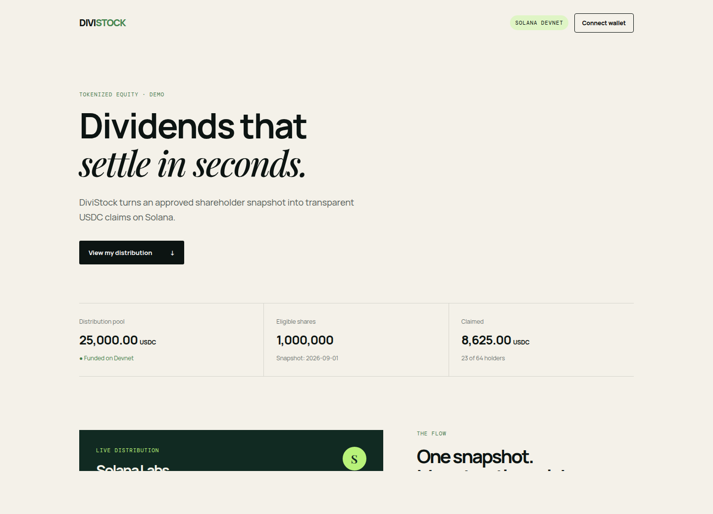

# DiviStock

**DiviStock makes a shareholder distribution verifiable, self-service, and auditable on Solana.** An issuer funds a USDC vault, publishes the snapshot's Merkle root, and each eligible holder submits a proof to claim exactly once.



## Demo

The interactive prototype shows one complete SOLX distribution: a funded pool, an eligible wallet, a claim, and a duplicate-claim safeguard. It intentionally starts in **simulation mode**: it sends no transaction and uses no real securities or funds.

The hosted demo is deployed from `main` through GitHub Pages at `https://chanta093.github.io/DiviStock/`.

Run it locally:

```bash
cd divistock
npx serve app
```

Open the address printed by `serve`. Select **Connect wallet**, then **Claim 125.00 USDC**. The available balance becomes zero and the claimed total increases. A second click is ignored, mirroring the on-chain `ClaimReceipt` check.

## How the Devnet distribution works

1. An issuer builds a Merkle tree from `wallet, shares, distribution_id` records.
2. The issuer initializes the distribution, then transfers test USDC from its token account into a program-controlled vault with `fund_distribution`.
3. A holder calls `claim` with the leaf amount and proof.
4. The program recomputes and verifies the root, creates the holder's `ClaimReceipt` PDA, and transfers USDC from the vault.
5. A second claim fails because the same receipt PDA already exists.

The reference Anchor program is in [`programs/divistock/src/lib.rs`](programs/divistock/src/lib.rs). It is deliberately narrow: one token mint and one distribution are enough to review the atomic funding-to-claim flow.

## Devnet setup

Prerequisites: Rust, Solana CLI, Anchor, Node 20+, and a Phantom-compatible wallet.

```bash
solana config set --url devnet
solana airdrop 2
anchor build
anchor deploy
```

Set the resulting program ID in both `declare_id!` and `Anchor.toml`, then generate the root and holder proofs with:

```bash
node scripts/build-merkle.mjs data/snapshot.json data/distribution.json
```

The script hashes the same byte sequence as the program: the 32-byte decoded Solana public key followed by the entitlement as an unsigned 64-bit little-endian integer. Before presenting, verify the vault's Devnet token-account balance and open the claim transaction in Solana Explorer.

## Repository map

| Path | Purpose |
| --- | --- |
| `app/` | Responsive interactive demo UI |
| `programs/divistock/` | Anchor reference program for funding and claims |
| `scripts/build-merkle.mjs` | Deterministic snapshot and proof generator |
| `docs/presentation-script.md` | 2–3 minute English pitch and demo script |
| `docs/demo-checklist.md` | Live demo and reviewer checklist |

## Security model and limits

- The snapshot root commits to both wallet and entitlement; a proof cannot be reused by a different wallet.
- A PDA receipt prevents a successful claim from being repeated.
- The actual program must use audited token transfers, a canonical USDC mint, program-owned vault authority, expiration, and an issuer governance policy before any mainnet deployment.
- This repository is a hackathon prototype. It does not offer, issue, custody, or represent a real security.

## Presentation

[`assets/divistock-presentation.mp4`](assets/divistock-presentation.mp4) is a 2:23 captioned English presentation video. Its narration and capture plan are in [`docs/presentation-script.md`](docs/presentation-script.md). Re-render it with `bash scripts/render-presentation.sh` after changing the screen or captions.

## License

MIT
